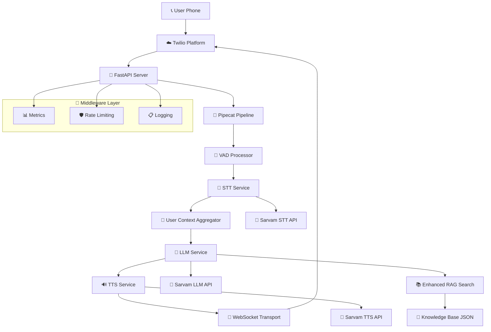

# Voice AI Bot

> **Production-ready multilingual voice AI bot powered by Twilio, Pipecat, and Sarvam AI**

[](https://python.org)
[](https://fastapi.tiangolo.com)
[](https://github.com/pipecat-ai/pipecat)
[](https://sarvam.ai)

## 🎯 Overview

A sophisticated voice AI bot that enables natural conversations over phone calls with support for multiple Indian languages. Built with modern async Python architecture using Pipecat framework and production-ready deployment capabilities.

### ✨ Key Features

- **🌐 Multilingual Support**: Telugu, Hindi, English with native Sarvam AI processing
- **⚡ Ultra-Low Latency**: Optimized pipeline with VAD-based audio buffering
- **🎙️ Advanced Voice Processing**: Voice Activity Detection, interruption handling, audio format conversion
- **🧠 Enhanced RAG Knowledge Base**: Contextual responses with semantic search
- **📊 Production Ready**: Docker support, Prometheus metrics, rate limiting, comprehensive logging
- **🔧 Modular Pipecat Architecture**: Clean frame-based processing, easily extensible
- **📞 Twilio Integration**: WebSocket streaming, TwiML webhooks, multi-language IVR

## 🏗️ Architecture



### Core Components

| Component | Technology | Purpose |
|-----------|------------|---------|
| **📞 Telephony** | Twilio Voice API + WebSocket | Call handling, real-time audio streaming |
| **🚀 Web Framework** | FastAPI + Uvicorn | Async HTTP server, webhook endpoints |
| **🔄 Voice Pipeline** | Pipecat Framework | Frame-based audio processing orchestration |
| **🧠 AI Services** | Sarvam AI Suite | STT (Saarika), LLM (Sarvam-M), TTS (Bulbul) |
| **🎤 Audio Processing** | VAD + Custom Utils | Voice activity detection, format conversion |
| **📚 Knowledge Base** | Enhanced RAG + JSON | Semantic search with contextual responses |
| **📊 Monitoring** | Prometheus + Loguru | Metrics collection and structured logging |

## 🚀 Quick Start

### Prerequisites

- Python 3.11+
- Twilio account with phone number
- Sarvam AI API key
- Public HTTPS URL (ngrok for development)

### Installation

1. **Clone the repository**
   ```bash
   git clone <repository-url>
   cd voice-ai-bot
   ```

2. **Set up environment**
   ```bash
   python -m venv venv
   source venv/bin/activate  # On Windows: venv\Scripts\activate
   pip install -r requirements.txt
   ```

3. **Configure environment**
   ```bash
   cp .env.example .env
   # Edit .env with your credentials
   ```

4. **Run the application**
   ```bash
   python -m uvicorn app.main:app --host 0.0.0.0 --port 8000
   ```

### Docker Deployment

```bash
# Build and run with Docker Compose
docker-compose up -d

# Check logs
docker-compose logs -f
```

## ⚙️ Configuration

### Environment Variables (.env)

```env
# Server Configuration
SERVER_URL=https://your-domain.com

# Twilio Credentials
TWILIO_ACCOUNT_SID=your_account_sid
TWILIO_AUTH_TOKEN=your_auth_token
TWILIO_PHONE_NUMBER=+1234567890

# Sarvam AI
SARVAM_API_KEY=your_api_key
```

### Application Settings (config.yaml)

```yaml
# AI Models
stt:
  model: saarika:v2.5
  sample_rate: 16000

llm:
  model: sarvam-m
  max_tokens: 512
  temperature: 0.7

tts:
  model: bulbul:v2
  voice: anushka
  sample_rate: 8000

# Voice Activity Detection
vad:
  enabled: true
  confidence: 0.7
  stop_secs: 1.5
  start_secs: 0.3
```

## 📞 Usage

### Making a Call

1. **Call the Twilio number**
2. **Select language** (1=Telugu, 2=Hindi, 3=English)
3. **Start conversation** - the AI will respond naturally

### API Endpoints

| Endpoint | Method | Purpose |
|----------|--------|---------|
| `/voice/incoming` | POST | Initial call webhook |
| `/voice/language-selected` | POST | Language selection handler |
| `/media-stream` | WebSocket | Real-time audio streaming |
| `/health` | GET | Health check |
| `/analytics` | GET | Call analytics |

## 🔧 Development

### Project Structure

```
voice-ai-bot/
├── app/                    # Application core
│   ├── main.py            # FastAPI application
│   ├── config.py          # Configuration management
│   └── constants.py       # Global constants
├── api/                    # API layer
│   └── routes/            # Route handlers
├── services/               # AI services
│   ├── stt/               # Speech-to-Text
│   ├── llm/               # Language Model
│   └── tts/               # Text-to-Speech
├── pipeline/               # Pipecat pipeline
├── transport/              # WebSocket transport
├── knowledge/              # Knowledge base
├── utils/                  # Utilities
├── models/                 # Domain models
├── docs/                   # Documentation
└── tests/                  # Test suite
```